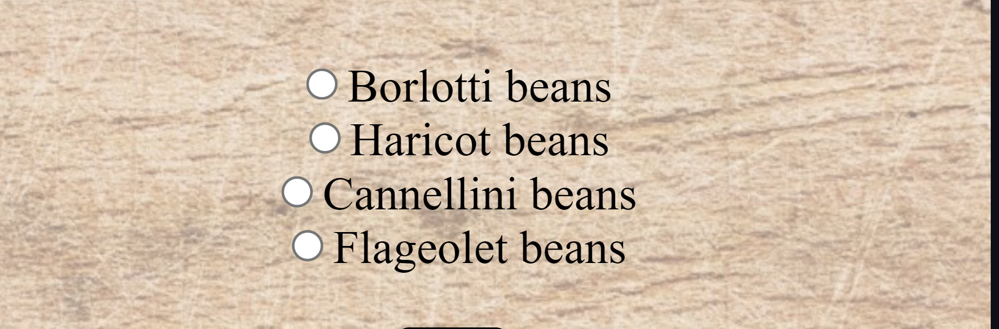
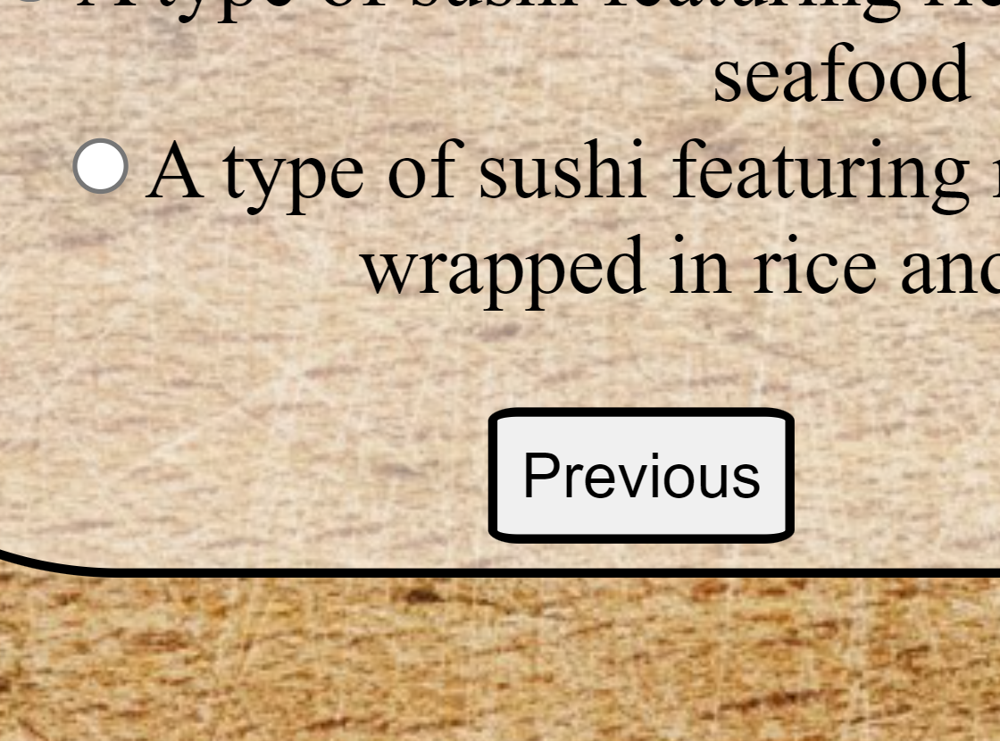
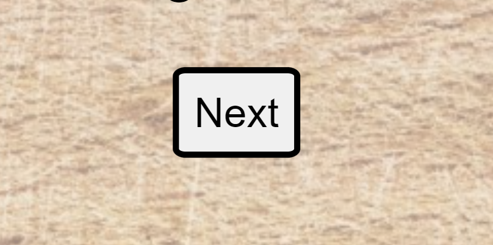

# myFoodQuiz

myFoodQuiz is a short and simple online quiz to test your knowledge about cousine.

## Features

<li>There are 4 radio buttons for the different answer options</li>

<li>There is a previous button on pages from 2 to 10</li>

<li>There is a next button on pages from 1 to 9</li>

<li>There is a submit quiz button on the last pages to submit your questions</li>

## Testing
<li>I have tested my website on different browsers: Mozilla Firefox, Microsoft Edge and Google Chrome and I have confirmed that the website works on all 3.

## Validator Testing

<li> I have tested the website with HTML Checker and it returned no errors

<li> CSS
<li> I discovered errors 
1: I had background-color: cover;
2: Forgot a curly brace at the end of media query
I fixed both and as of now there is no more errors
<li>JShint

## Credits

## Media
<li> Background image was taken from (https://www.pexels.com/) I choose a chopping board background image as its a food quiz.

## Content
<li> Tutorial Bee Coder on youtube https://www.youtube.com/watch?v=j9Elj5Sxfug&t=463s
<li> For the styling used a lot of code from my previous project St. Michael's Centre https://mrusinova.github.io/st-michaels/
<li> Questions and answers taken from https://www.bbcgoodfood.com/howto/guide/food-quiz

## Deployment
<li> The site was deployed to GitHub pages. The steps to deploy are as follows:
<li> In the GitHub repository, navigate to the Settings tab
<li> From the source section drop-down menu, select the Master Branch
 <li>Once the master branch has been selected, the page will be automatically refreshed with a detailed ribbon display to indicate the successful deployment.

 The live website can be seen here: https://mrusinova.github.io/myFoodQuiz/