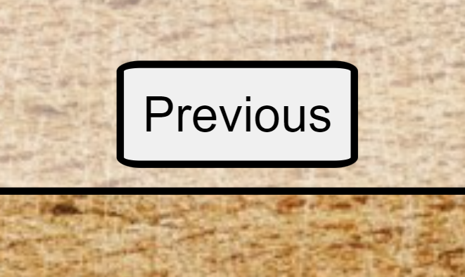
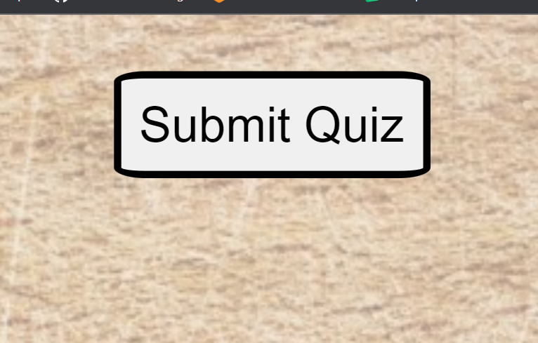

# myFoodQuiz

myFoodQuiz is a short and simple online quiz to test your knowledge about cousine.

## Features

<li>There are 4 radio buttons for the different answer options</li>

<li>There is a previous button on pages from 2 to 10</li>

<li>There is a next button on pages from 1 to 9</li>

<li>There is a submit quiz button on the last pages to submit your questions</li>

## Testing
<li>I have tested my website on different browsers: Mozilla Firefox, Microsoft Edge and Google Chrome and I have confirmed that the website works on all 3.

## Validator Testing

<li> I have tested the website with HTML Checker and it returned no errors

<li> CSS
<li> I discovered errors 
1: I had background-color: cover;
2: Forgot a curly brace at the end of media query
I fixed both and as of now there is no more errors
<li>JShint

## Credits

## Media
<li> Background image was taken from (https://www.pexels.com/)